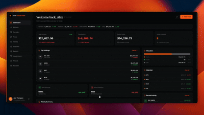

<p align="center">
  
</p>

<h1 align="center">Open Papertrade</h1>

<p align="center">
  <a href="#quickstart"></a>
  <a href="#tech-stack"></a>
  <a href="#llm-provider-setup"></a>
  <a href="#license"></a>
  <a></a>
  <a></a>
</p>

<p align="center">
  <em>An applied-AI trading lab. Paper trading on live market data, strategy backtesting, LLM behavioral coaching, and an agentic RAG analyst over SEC filings — cited, verifiable, and refusal-first.</em>
</p>

---
<p align="center">
  
</p>

## About

**Open Papertrade** is a full-stack learning platform for retail trading that sits at the intersection of finance and applied AI. It goes beyond simulated trades: users can run virtual portfolios on **live market data**, backtest strategies over historical windows, follow other traders, receive **behavioral coaching from an LLM** based on their own trade history, and interrogate **SEC filings** through an **agentic RAG pipeline** that cites every claim and declines when the corpus doesn't support an answer.

The project is designed both as a functioning product and as a reference implementation of several real-world AI patterns — provider-agnostic LLM abstractions, hybrid dense/sparse retrieval with cross-encoder reranking, static agent decomposition over tool-use loops, and honest refusal behavior grounded in the eval numbers.

### All without real financial exposure.
---

## Features

- **Paper trading**: virtual portfolios, market/limit orders, holdings, transaction history, and price alerts, all backed by real-time quotes.
- **Charting**: TradingView-style interactive charts with technical indicators and pattern detection.
- **Backtesting engine**: build, run, and analyze trading strategies against historical market data with performance metrics.
- **AI Coach**: LLM-powered behavioral pattern analysis over your trade history: risk scoring, tips, and an interactive chat that reasons about your positions.
- **Copy trading**: follow leader accounts, mirror trades, and manage relationships.
- **Filings Research Analyst**: agentic RAG over SEC EDGAR filings (10-K, 10-Q, 8-K) with hybrid retrieval, cross-encoder reranking, and per-claim citations that link back to sec.gov. Refuses to answer when the corpus doesn't support the claim.
- **Multi-provider LLM support**: Anthropic, OpenAI, OpenRouter, Mistral, Ollama, or any OpenAI-compatible local runner (LM Studio, vLLM, llama.cpp).
- **Leaderboard, friends, achievements**: social layer for gamified learning.
- **Full admin dashboard**: Django-Unfold styled admin for every model.

---

## Tech stack

| Layer | Choice | Why |
|---|---|---|
| **Backend** | Django 6 + Django REST Framework | Batteries-included admin, ORM, migrations, auth. |
| **Frontend** | Next.js 15 (App Router, TypeScript) | Modern React with server components, Tailwind CSS 4. |
| **Database** | SQLite (dev) / PostgreSQL via Supabase (prod) | Zero-config locally, standard scale in prod. |
| **Auth** | Cookie-based JWT with rotation + 2FA (TOTP) | Secure by default, no third-party auth vendor. |
| **Market data** | Finnhub primary, Yahoo Finance fallback | Free tier viable, redundant providers. |
| **Embeddings** | `sentence-transformers/all-MiniLM-L6-v2` (384-d) | Small, fast, runs on CPU, good enough with hybrid + rerank. |
| **Vector store** | Postgres `BinaryField` + NumPy matmul | Fast at portfolio scale (~10k chunks). Migrates to pgvector in ~50 lines when the corpus grows. |
| **Sparse retrieval** | `rank-bm25` | Complements dense; catches exact-term matches (statutes, tickers). |
| **Reranker** | `cross-encoder/ms-marco-MiniLM-L-6-v2` | Big precision lift on top-K, ~200ms cost. |
| **LLM** | Provider-agnostic — Anthropic / OpenAI / OpenRouter / Mistral / Ollama / any OpenAI-compat local server | Swap with one env variable. |

---

## Prerequisites

Before you start, make sure you have:

- **Python 3.10+** — `python --version`
- **Node.js 20+** — `node --version`
- **Git** — for cloning
- **~2 GB free disk** — Python deps + embedding model
- **An LLM API key** — one of Anthropic, OpenAI, OpenRouter, or Mistral. Or Ollama for fully-local free inference.

---

## Quickstart

Complete setup takes about **15 minutes** (including a first LLM call and one seeded 10-K).

```bash
# 1. Clone
git clone https://github.com/Open-Papertrade/Open-Papertrade.git
cd Open-Papertrade

# 2. Backend
cd backend
python -m venv .venv
source .venv/bin/activate            # Windows: .\.venv\Scripts\activate
pip install -r requirements.txt
cp .env.example .env                  # then edit — see below
python manage.py migrate
python manage.py runserver            # Terminal 1

# 3. Frontend (new terminal)
cd ../frontend-ui
npm install
cp .env.example .env.local
npm run dev                           # Terminal 2
```

Open **http://localhost:3000** and log in / sign up.

---

## Detailed setup

### Backend

```bash
cd backend
python -m venv .venv
source .venv/bin/activate            # macOS/Linux
# .\.venv\Scripts\activate            # Windows PowerShell
pip install -r requirements.txt
```

Configure `backend/.env`:

```bash
cp .env.example .env
```

At minimum, set these fields in `.env`:

```bash
DEBUG=True
SECRET_KEY=<any-long-random-string>
ALLOWED_HOSTS=localhost,127.0.0.1
CORS_ALLOWED_ORIGINS=http://localhost:3000

# For the Filings Research feature (SEC bans generic user-agents)
SEC_EDGAR_USER_AGENT=Your Name (your-email@example.com)

# LLM provider — see next section for options
LLM_PROVIDER=openrouter
OPENROUTER_API_KEY=sk-or-v1-...
OPENROUTER_MODEL=anthropic/claude-3.5-sonnet
```

Run migrations and start the server:

```bash
python manage.py makemigrations
python manage.py migrate
python manage.py createsuperuser     # optional — for /admin/
python manage.py runserver           # serves on http://localhost:8000
```

Health check in a new terminal:
```bash
curl http://localhost:8000/api/
```

### Frontend

```bash
cd frontend-ui
npm install
cp .env.example .env.local           # already correct for local dev
npm run dev                          # serves on http://localhost:3000
```

That's it! Open **http://localhost:3000**.

---

## LLM provider setup

The app talks to LLMs through a single interface (`backend/filings/services/llm/`). Six providers ship out of the box. Pick one, set the corresponding env variables, and set `LLM_PROVIDER` to the provider's slug.

| Provider | `LLM_PROVIDER=` | Env var(s) | Notes |
|---|---|---|---|
| **Anthropic** | `anthropic` | `ANTHROPIC_API_KEY` | Strong instruction-following and honest refusals. |
| **OpenAI** | `openai` | `OPENAI_API_KEY` | Standard hosted models. |
| **OpenRouter** | `openrouter` | `OPENROUTER_API_KEY`, `OPENROUTER_MODEL` | One key → hundreds of models (Claude, GPT, Mistral, Llama, Gemini, DeepSeek). **Recommended** for A/B testing across providers. |
| **Mistral** | `mistral` | `MISTRAL_API_KEY` | Direct Mistral API. Cheaper than GPT-4-class for many tasks. |
| **Ollama** | `ollama` | `OLLAMA_BASE_URL` | Local, zero cost. `ollama pull llama3.1` first. |
| **Local (generic)** | `local` | `LOCAL_LLM_BASE_URL` | Any OpenAI-compatible local server: LM Studio (`:1234/v1`), vLLM (`:8000/v1`), llama.cpp-server (`:8080/v1`). |

### Choosing a model

For each provider, you can override the default model via `<PROVIDER>_MODEL` in `.env`:

```bash
# Examples — pick one
ANTHROPIC_MODEL=claude-sonnet-5
OPENAI_MODEL=gpt-4o-mini
OPENROUTER_MODEL=anthropic/claude-3.5-sonnet
MISTRAL_MODEL=mistral-large-latest
OLLAMA_MODEL=llama3.1:8b
LOCAL_MODEL=local-model
```

The generic `LLM_MODEL` env var also works as a fallback across providers.

### OpenRouter tips

- Get a key at **https://openrouter.ai/keys**. Some slugs are free; most are pay-as-you-go.
- Free-tier slugs (`:free`) come and go — check the currently-available list at **https://openrouter.ai/models**.
- Recommended paid entry point: `openai/gpt-4o-mini` (`~`$0.30 per 1000 questions) or `anthropic/claude-3.5-sonnet` (`~`$3 per 1000 questions).
- Set `OPENROUTER_REFERER` and `OPENROUTER_APP_TITLE` in `.env` for optional attribution on OpenRouter's public leaderboard.

---

## Filings Research setup

The Filings Research Analyst is disabled at first-run (the corpus is empty). Once your backend is running, you can add filings in two ways:

### Method A — Paste an SEC URL in the UI (self-service)

1. Log in and navigate to **Filings Research** in the sidebar.
2. In the "Add a filing by URL" box, paste any SEC EDGAR filing URL, e.g.:
   ```
   https://www.sec.gov/Archives/edgar/data/320193/000032019324000123/aapl-20240928.htm
   ```
3. Click **Ingest**. The job status polls live (`pending → running → success`) and takes 30–120 seconds per filing.
4. When complete, the filing appears in the "Ingested filings" list where you can view its source or delete it.

To find filing URLs, browse **https://www.sec.gov/cgi-bin/browse-edgar?action=getcompany**, click a filing, then copy the URL of its primary HTML document (usually the `.htm` file named after the ticker).

### Method B — Bulk seed via CLI

```bash
cd backend
source .venv/bin/activate

# Ingest 3 companies' latest 10-K
python manage.py ingest_filings AAPL NVDA TSLA --form 10-K --limit 1

# Time series for one company
python manage.py ingest_filings TSLA --form 10-K --limit 4

# Broader form types
python manage.py ingest_filings AAPL --form 10-Q --limit 2
python manage.py ingest_filings AAPL --form 8-K --limit 5
```

Flags:
- `--form 10-K|10-Q|8-K`
- `--limit N` — filings per company, most recent first
- `--chunk-tokens 400`, `--overlap 50` — override chunker defaults
- Command is idempotent — re-running skips filings already ingested.

**Note.** First run downloads the embedding model (`all-MiniLM-L6-v2`, ~90 MB from HuggingFace).

### Asking questions

Once the corpus has content, ask questions in the UI or via the API:

```bash
curl -X POST http://localhost:8000/api/filings/ask/ \
  -H 'Content-Type: application/json' \
  -d '{
    "question": "What are the largest risk factors disclosed?",
    "hybrid": true,
    "rerank": true,
    "agent": false
  }'
```

Toggles on the UI:
- **Hybrid** — dense embeddings + BM25 (recommended on).
- **Rerank** — cross-encoder pass over top candidates (recommended on).
- **Agentic** — decomposes multi-entity or comparison questions into sub-questions.

Every answer either produces inline `[S<n>]` citations linking back to sec.gov, or declines with *"I don't have enough information in the provided filings to answer that."*

### Running the evaluation harness

```bash
python manage.py evaluate --hybrid --rerank --out results.json
```

Outputs recall@k, MRR, faithfulness, and refusal accuracy — see the [FILINGS_GUIDE.pdf](FILINGS_GUIDE.pdf) for the full eval methodology.

---

## Environment variables

### Backend (`backend/.env`)

| Variable | Description | Required |
|---|---|---|
| `SECRET_KEY` | Django secret key | Yes |
| `DEBUG` | `True` in dev, `False` in prod | Yes |
| `ALLOWED_HOSTS` | Comma-separated hostnames | Yes |
| `CORS_ALLOWED_ORIGINS` | Frontend origin(s) | Yes |
| `FINNHUB_API_KEY` | Real-time market data — falls back to Yahoo Finance | No |
| `DATABASE_URL` | Postgres connection string | Prod only |
| `SUPABASE_URL`, `SUPABASE_SERVICE_ROLE_KEY`, `SUPABASE_STORAGE_BUCKET` | Media storage in prod | Prod only |
| `SEC_EDGAR_USER_AGENT` | Identifies you to SEC (blocks generic UAs) | For Filings feature |
| `LLM_PROVIDER` | `anthropic` / `openai` / `openrouter` / `mistral` / `ollama` / `local` | For any LLM feature |
| `LLM_MODEL` | Generic model override (per-provider takes precedence) | No |
| `ANTHROPIC_API_KEY`, `ANTHROPIC_MODEL` | Anthropic | If `LLM_PROVIDER=anthropic` |
| `OPENAI_API_KEY`, `OPENAI_MODEL` | OpenAI | If `LLM_PROVIDER=openai` |
| `OPENROUTER_API_KEY`, `OPENROUTER_MODEL`, `OPENROUTER_REFERER`, `OPENROUTER_APP_TITLE` | OpenRouter | If `LLM_PROVIDER=openrouter` |
| `MISTRAL_API_KEY`, `MISTRAL_MODEL` | Mistral | If `LLM_PROVIDER=mistral` |
| `OLLAMA_BASE_URL`, `OLLAMA_MODEL` | Ollama (default `http://localhost:11434`) | If `LLM_PROVIDER=ollama` |
| `LOCAL_LLM_BASE_URL`, `LOCAL_MODEL` | Any OpenAI-compatible endpoint | If `LLM_PROVIDER=local` |
| `FILINGS_EMBEDDING_MODEL` | Embedding model name | No (default: `sentence-transformers/all-MiniLM-L6-v2`) |
| `FILINGS_CHUNK_TOKENS`, `FILINGS_CHUNK_OVERLAP` | Chunking tuning | No |

### Frontend (`frontend-ui/.env.local`)

| Variable | Description | Default |
|---|---|---|
| `NEXT_PUBLIC_API_URL` | Backend base URL | `http://localhost:8000/api` |

---

## Common commands

```bash
# --- Backend (in an activated venv) ---
python manage.py runserver               # start the API server
python manage.py migrate                 # apply migrations
python manage.py makemigrations          # generate migrations after model changes
python manage.py createsuperuser         # create an admin user
python manage.py shell                   # interactive Django shell

# --- Filings Research ---
python manage.py ingest_filings AAPL NVDA TSLA --form 10-K --limit 1
python manage.py evaluate --hybrid --rerank --out results.json

# --- Frontend ---
npm run dev                              # dev server with hot reload
npm run build                            # production build
npm run start                            # serve the production build
```

---

## Troubleshooting

| Symptom | Cause / Fix |
|---|---|
| `403 SEC.gov Denial of Service` | Missing / generic User-Agent. Set `SEC_EDGAR_USER_AGENT` in `.env` to a real name + email and restart. |
| `ModuleNotFoundError: dj_database_url` (or any dep) | Virtual environment not active. `source .venv/bin/activate && pip install -r requirements.txt`. |
| `<PROVIDER>_API_KEY not set` on `/ask/` | `.env` not loaded or `LLM_PROVIDER` doesn't match the key you set. Restart the server after editing `.env`. |
| `502` from `/api/filings/ask/` with `"llm_provider_error"` | LLM upstream error — check the JSON `detail` field for the actual message. Common causes: expired key, deprecated model slug, no credits. |
| `Ticker not found on EDGAR` | EDGAR only lists US-registered public companies. Use the URL-paste method for a specific filing. |
| Frontend shows "Failed to fetch" | Backend not running, wrong `NEXT_PUBLIC_API_URL`, or CORS. Confirm backend on `:8000` and check `CORS_ALLOWED_ORIGINS`. |
| Ingest job stuck at `pending` | First ingest downloads the embedding model (~90 MB). Watch backend logs. If offline, this hangs — retry when online. |
| Hot-reload changes not showing | `rm -rf frontend-ui/.next` then `npm run dev`. Hard-refresh the browser (`Cmd/Ctrl+Shift+R`). |

For deeper details on the filings pipeline (ingestion, retrieval, agentic loop, evals), see [FILINGS_GUIDE.pdf](FILINGS_GUIDE.pdf).

---

## Contributing

We welcome contributors of all levels. See [CONTRIBUTING.md](./CONTRIBUTING.md) for guidelines on issues, PRs, and code style.

Good places to start:
- Improve the chunker (table-aware, sentence-boundary-snapping) — see IDEA.md §16.
- Grow the eval gold sets in `backend/filings/evals/data/`.
- Add tests for new backtesting strategies.
- Improve mobile responsiveness of the frontend.

---

## Funding & Sponsorship

This project is independently developed and maintained. Running it in production incurs real costs for hosting, market-data quotas, and LLM inference.

If you're interested in sponsoring server infrastructure or LLM credits:

**mymadhavyadav07@gmail.com**

Your support helps with:
- Reliable uptime and faster execution
- Broader corpus coverage for the filings research feature
- Continued open-source development

---

## License

This project is licensed under the **GNU Affero General Public License v3.0 (AGPL-3.0)**.

| Action | Allowed? | Notes |
|---|---|---|
| **Use** | ✅ | Personal, educational, or commercial. |
| **Modify** | ✅ | Modify freely for your own use. |
| **Distribute** | ✅ | Must provide source under AGPL-3.0. |
| **Sell / commercial use** | ✅ | Allowed — modifications must remain open source. |
| **Host as SaaS / network use** | ✅ | Must make modified source code available to users. |
| **Private internal use** | ✅ | Use internally without sharing code. |
| **Relicense as proprietary** | ❌ | AGPL forbids closed-source relicensing. |
| **Warranty / liability** | ⚠️ None | Software provided "as-is". |

Full text: [GNU AGPLv3](https://www.gnu.org/licenses/agpl-3.0.html).

---

## Disclaimer

For educational and research purposes only. **Not financial advice.** All trades are simulated; no real capital is at risk. LLM outputs — including the Filings Research Analyst — may be incorrect and must be verified against primary sources before use in any real-world decision.

---

<p align="center">
  Made with ❤ in India.
</p>


